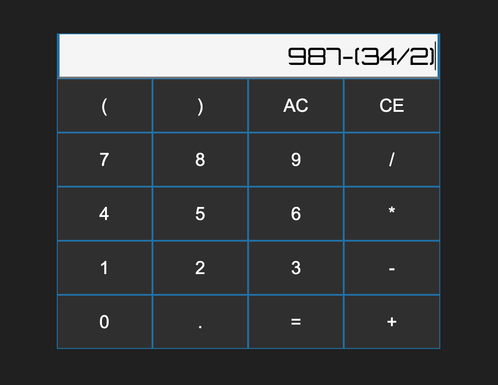

# calculator


 Deployed application here: http://3.219.168.222:3000/

## Overview

Simple calculator with minimal erroring.

- Handles basic arithmetic operations (+ - / *) and nested parens.
- Controlled input significantly reduces the incidence of errors and makes for an intuitive user experience.
- Responsive keypad view highlights user keypresses. 

## Usage

- Beginning your entry with just an operator will stub out an expression or float for you. Ex: 0+3 or 0.3
- Submit entry for evaluation with Enter or '='.

## Installation

1. Clone down repository.
2. Install dependencies: 
```npm install```
4. Build webpack bundle with watch flag: 
```npm run build ```
2. Start the server:
````npm run server````

## Technologies

- React 
- Webpack
- Babel
- Express
- AWS EC2
- Babel
- Jest
- Docker
- Node.js
- sinful-math
